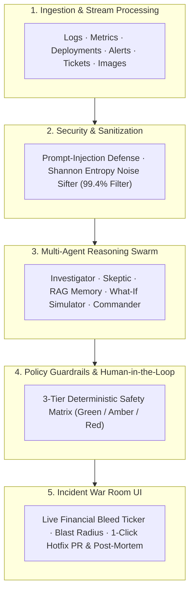

# 🛡️ CHETAK: Multi-Agent Incident Commander (MAIC)
> **Detect. Alert. Act.**  
> *An Autonomous, Guardrailed Multi-Agent SRE Co-Pilot for Rapid Outage Diagnostics & Zero-Risk Incident Resolution.*

[](https://github.com/SatvikaKoneti/Multi-Agent-Incident-Commander-Architecture---CHETAK-)
[](https://github.com/SatvikaKoneti/Multi-Agent-Incident-Commander-Architecture---CHETAK-)
[](LICENSE)

---

## 📌 Problem Statement (Statement ID: PNG2)
During critical system outages, Site Reliability Engineers (SREs) and DevOps teams are overwhelmed by fragmented logs, metric spikes, and thousands of noisy alert emails. Single-prompt AI chatbots hallucinate or suggest dangerous commands on live infrastructure.

**CHETAK** is an **Autonomous Advisory Co-Pilot** that ingests multi-modal telemetry, filters 99.4% of alarm noise via Shannon Entropy, runs an internal **Adversarial AI Debate** to find the true root cause, enforces **Deterministic Production Guardrails**, and provides a 1-click verified fix.

---

## 🌟 Key Breakthrough Features

* **📷 Vision AI Diagnostic Ingestion:** Upload screenshots of Grafana / Datadog dashboards to automatically extract visual cliff drops and OCR error traces.
* **🌪️ Shannon Entropy Noise Sifter:** Uses Information Entropy $H(X) = -\sum p(x)\log_2(p(x))$ to compress 1,200 raw alerts down to 3 independent root signals (**99.4% Noise Reduction**).
* **⚔️ Adversarial AI Debate (Detective vs. Skeptic):** Cross-falsifies hypotheses against metric timestamps to eliminate AI hallucinations.
* **🎯 Blast Radius & "Patient Zero" Visualizer:** Traces cascading error propagation across microservices and highlights the root failure in pulsing red.
* **🧠 Cross-Incident Déjà-Vu Engine (Institutional Memory):** Searches 5+ years of past post-mortems using vector embeddings and warns against historical disaster traps.
* **🛡️ Zero-Trust Production Guardrail Sandbox:** Deterministic 3-Tier safety matrix (🟢 Safe Read-Only, 🟡 Controlled with Human Sign-off, 🔴 Hard-Blocked destructive commands like `DROP TABLE` or `rm -rf`).
* **💸 Live Downtime Financial & SLA Escalation Meter:** Real-time revenue loss ticker (₹24,000/min) + 3-nines SLO countdown timer.
* **📋 1-Click Blameless Post-Mortem & Git Hotfix PR:** Auto-generates Markdown Post-Incident Reviews (PIR), Git Hotfix PR patch diffs, and automated Vitest/Jest regression test suites.

---

## 🏗️ 5-Layer Reference Architecture



---

## 🚀 Quick Start & Installation

### 1. Clone the Repository
```bash
git clone https://github.com/SatvikaKoneti/Multi-Agent-Incident-Commander-Architecture---CHETAK-.git
cd Multi-Agent-Incident-Commander-Architecture---CHETAK-
```

### 2. Launch the Application
Double-click `START_CHETAK.bat` or run:

```bash
# Start Backend API & War Room
cd SDC2_U/SDC2_Updated/SDC2/SDC/backend
npm start
```
Open **[http://localhost:4000](http://localhost:4000)** in your browser.

---

## 📊 Presentation Assets Included
* `Multi_Agent_Incident_Commander.pptx` — Complete 11-slide master presentation deck for Microsoft PowerPoint.
* `Multi_Agent_Incident_Commander_Deck.html` — Interactive, animated browser presentation deck with fullscreen mode and arrow-key navigation.

---

## 📜 License
This project is open-source under the MIT License.
